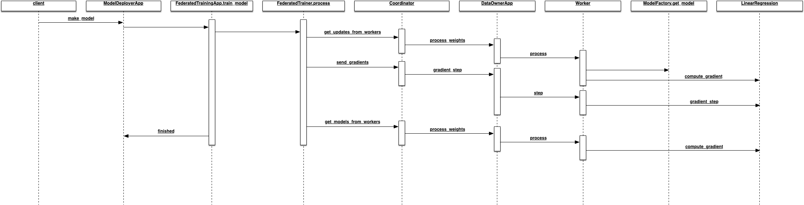

federated_trainer
=================

1. Setup the scaffolding of a basic implementation of federated training

2. Added Homomorphic Encryption (`Paillier crypto system <https://en.wikipedia.org/wiki/Paillier_cryptosystem>`_)

3. Started UI components. Instead of React, using the `Svelte / Sapper framework <https://sapper.svelte.dev/>`_.
   Investigating if faster, smaller, and simpler. Svelte uses a novel approach of compiling to optimized
   Javascript instead of runtime processing of a virtual DOM as with React. In theory, this means that
   packaged code will be significantly smaller and faster. Svelte is reactive and influenced by Elm.

Differential privacy hasn't been setup yet.

Running
-------

1. Open up 4 terminal tabs.

2. In the first tab, run:
   ::

       ./run_federated_training.sh

   This runs the server component on port 8080.

3. In the second tab, run:
   ::

       ./run_data_owner.sh

   This runs the local worker (data owner) on port 5000.

4. In the third tab, run:
   ::

       ./run_model_deployer.sh

   This runs the model deployer on port 9090.

5. In the fourth tab, run:
   ::

       curl -X POST "http://localhost:9090/model"

   This initiates model deployment. The default Linear Regression model is run in a federated fashion.

6. When the process completes, in the fourth tab, run the following to get the final cost metric
   and predicted values.
   ::

       curl "http://localhost:9090/prediction"

